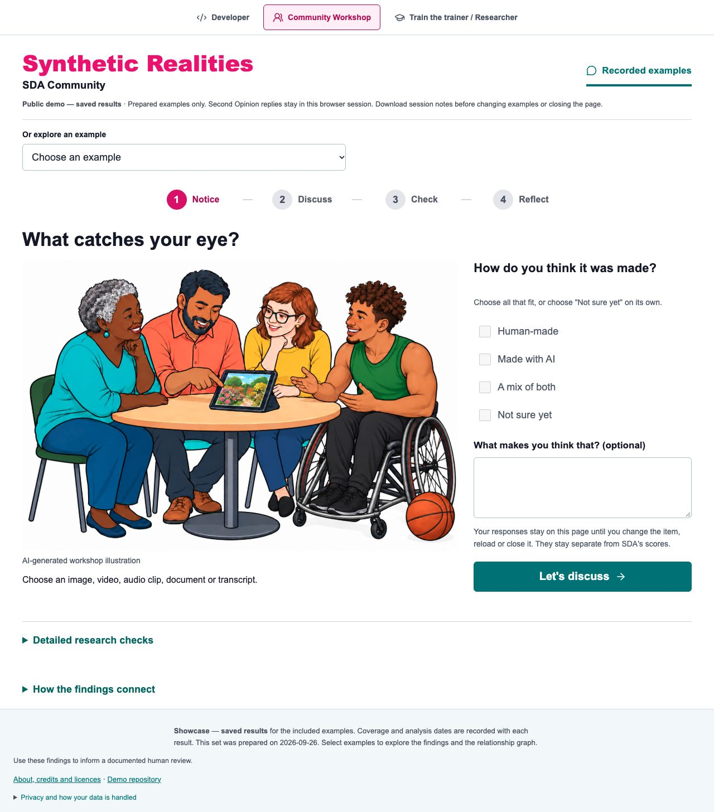

# SDA Vision — interactive demo

The demo opens in **Community Workshop**. [Explore the live demo](https://synthetic-realities.github.io/sda-vision-demo/).

The opening illustration supports all four workshop activities and has saved
Claude, OpenAI and Gemini findings. The menu offers ten further examples.
[Workshop and Facilitator guide](docs/Workshop_Activities_2026-09-25.md).

An academic research project of **Synthetic Realities**, led by **Dr Sam Martin**, Smart Data Research UK (UKRI) Fellow (Grant number UKRI4010.), Manchester Metropolitan University (MMU). [ORCID: 0000-0002-4466-8374](https://orcid.org/0000-0002-4466-8374).

This work was supported by Smart Data Research UK, a UKRI investment; Grant number UKRI4010.

This repository contains the prepared website, ten approved examples and their
saved findings. All ten have recorded Claude, OpenAI and Gemini
assessments. The PDF and presentation each use four sampled images; the podcast
assessment covers a transcript excerpt. Visitors can explore Developer and Community Workshop views, use prepared batches and download reports. Newly collected Second Opinion
replies remain in browser memory and can be exported separately from recorded findings.
The website uses prepared media and saved assessments; visitor uploads and live
analysis are outside this demo profile.

The complete research application source is being prepared separately for an
open-source software release and a versioned Zenodo archive. The software release
and DOI will accompany that separate archive.

## Developer view and project resources

The Developer view compares the recorded model assessments, credential findings and supporting observations. Its header links to the public GitHub project and illustrated facilitator guide, with an expandable citation for the demo. Green status dots indicate available recorded results; each report supplies the check details.

The full application is being prepared for an MIT open-source installation release. [Developer view and website discovery](docs/Developer_Demo_And_Discovery_2026-09-27.md) records the current publication status and search metadata.

## Illustrated facilitator guide

For **community facilitators, trainers, educators and researchers** leading workshops, conference sessions or online discussions. The six-page guide combines screenshots, colourful group questions and practical notes for **Notice → Discuss → Check → Reflect**.

Before the session, read through the pack and choose an approved example. With the group, invite first impressions, compare explanations and then explore the recorded findings. Close by choosing practical next steps and downloading any session notes you want to keep. Adapt the pace and questions to the group.

[Explore the guide and how to use it](https://synthetic-realities.github.io/sda-vision-demo/facilitator.html) · [Repository guide](docs/Facilitator_Guide.md).

| Workshop Activity 1 — Notice | Workshop Activity 2 — Discuss |
| --- | --- |
|  |  |

**Notice** makes room for looking, listening and first impressions. **Discuss** invites people to explain the details behind their view. The full pack also includes Check, Reflect and session guidance.

[Download the full facilitator pack (PDF, version 1.0)](docs/guides/SDA_Vision_Facilitator_Guide_v1.0.pdf).

## Credits and terms

The project code in this website uses [MIT](LICENSE). Example media, fonts and
third-party dependencies retain their separate terms:

- [Example credits and media terms](site/showcase/CREDITS.md)
- [Dependency and font notices](site/third_party/README.md)
- [Website scope and privacy](https://Synthetic-Realities.github.io/sda-vision-demo/about.html)

## Verification and updates

The prepared site comes from the tested September 2026 candidate: 312 offline
Python checks, fresh installation, frontend builds and export checks passed.
Original media and earlier recorded results are preserved. The model refresh
completed 52 preparation API requests across the original eleven examples. The
current ten-example selection retains 30 completed model rows. The facilitator-guide release has 27 passing focused checks, TypeScript and both frontend builds, with desktop and 390-pixel browser checks. The demo notice sits beneath the branding; the footer groups credits, repository and privacy links. Physical-device, projector, browser file-saving and
native presentation-software rehearsals remain to be completed.

`DEMO_MANIFEST.json` records exact SHA-256 hashes of deployed files. Deployment is
manual through the Pages workflow; it publishes only `site/`. The published files
are the static website and reviewed example bundle. Backend
services, API credentials, private source keys and restricted conference videos
remain outside that bundle. For questions and feedback, use this repository's
Issues with a non-sensitive description or synthetic example.

The [27 September copy review](docs/Editorial_Review_2026-09-27.md) records the
current wording update, checks and boundaries. It preserves the saved analyses
and their method version.
