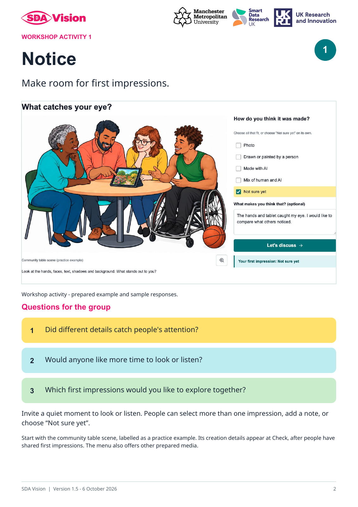
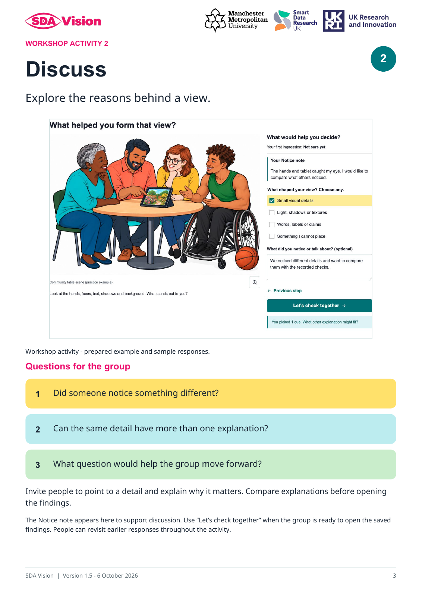
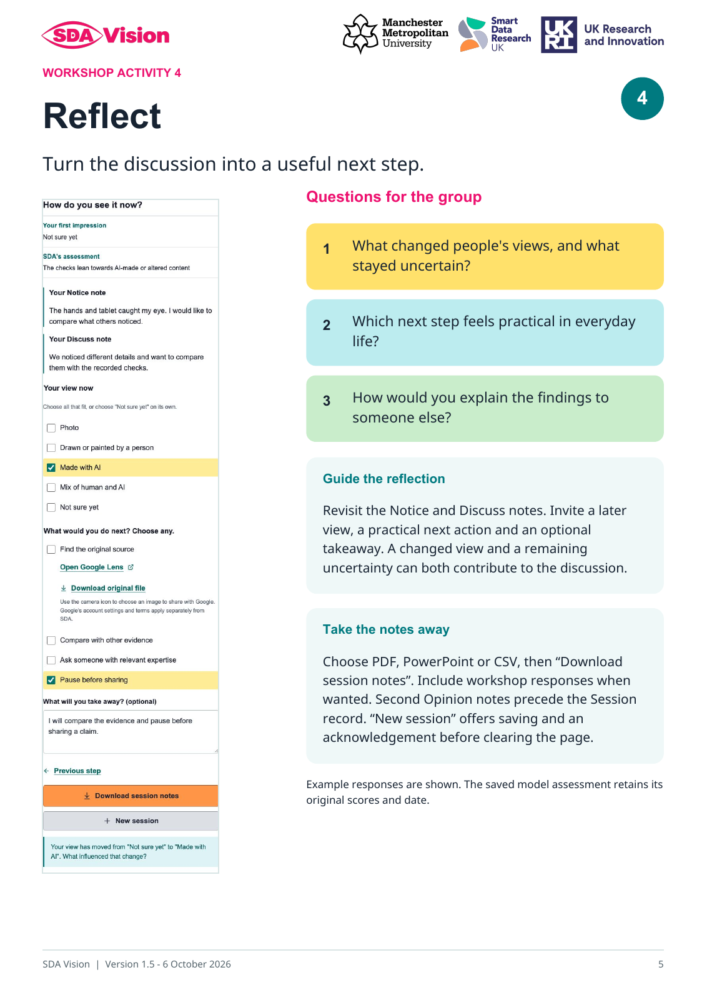

# Interactive demo

 · 

Software and guide badges link to their latest published Zenodo versions.

SDA stands for **Synthetic-media Discourse Analysis**. SDA Vision supports research and group discussion about **AI-generated and traditional media**.

The demo opens in **Community Workshop**. [Explore the live demo](https://sdavision.io/).

The opening illustration supports all four workshop activities and has saved
Claude, OpenAI and Gemini findings. The menu offers ten further examples.
[Workshop and Facilitator guide](docs/Workshop_Activities_2026-09-25.md).

An academic research project of **Synthetic Realities**, led by **Dr Sam Martin**, Smart Data Research UK (UKRI) Fellow (Grant number UKRI4010), Manchester Metropolitan University (MMU). [ORCID: 0000-0002-4466-8374](https://orcid.org/0000-0002-4466-8374).

This work was supported by Smart Data Research UK, a UKRI investment; Grant number UKRI4010.

This repository contains the prepared website, ten menu examples, an opening practice illustration and their
saved findings. All eleven have recorded Claude, OpenAI and Gemini
assessments. The PDF and presentation each use four sampled images; the Animated video uses four sampled still frames. The podcast
assessment covers the first 12,000 of 25,985 transcript characters (about 46%), with a separate saved Gemini description of its first 20 seconds of sound. Visitors can explore Developer and Community Workshop views, use prepared batches and download reports. Newly collected Second Opinion
replies remain in browser memory and can be exported separately from recorded findings.
The website uses prepared media and saved assessments; visitor uploads and live
analysis are outside this demo profile.

The [complete open-source application and installation guide](https://github.com/Synthetic-Realities/sda-vision-source#start-here) are available in a separate software repository under MIT. [Software 0.1.1](https://zenodo.org/records/23039037) and [facilitator guide 1.4](https://zenodo.org/records/23008189) are published on Zenodo.

Google Lens is available for image files. PDFs, slides, podcasts and videos retain their original-file downloads, with image-search controls reserved for images. [Image-search scope](docs/Image_Search_Scope_2026-09-29.md).

Reflect keeps its findings and Evidence box inside **Revisit the recorded findings**, collapsed until opened. Session notes and New session remain visible. [Software 0.1.1 release details](release/RELEASE_0.1.1.md).

## Developer view and project resources

The Developer view compares the recorded model assessments, credential findings and supporting observations. Its header links to the public GitHub project and illustrated facilitator guide, with an expandable citation for the demo. Green status dots indicate available recorded results; each report supplies the check details. The Batch queue is collapsed until selected, with file and selection counts visible. Each analysis includes a Harvard-style software citation for Dr Sam Martin, MMU and the Smart Data Research UK funding acknowledgement, grant UKRI4010. [Batch and citation details](docs/Batch_And_Citation_2026-09-28.md).

[Install the full application](https://github.com/Synthetic-Realities/sda-vision-source#start-here) to work locally with your own media and configured provider accounts. [Developer view and website discovery](docs/Developer_Demo_And_Discovery_2026-09-27.md) records the current publication status and search metadata.

## Illustrated facilitator guide

For **community facilitators, trainers, educators and researchers** leading workshops, conference sessions or online discussions about AI-generated and traditional media. The seven-page guide combines screenshots, colourful group questions and practical notes for **Notice → Discuss → Check → Reflect**.

Before the session, read through the pack and choose an example you have permission to share. With the group, invite first impressions, compare explanations and then explore the recorded findings. Close by choosing practical next steps and downloading any session notes you want to keep. Adapt the pace and questions to the group.

[Explore the guide and how to use it](https://sdavision.io/#facilitator) · [Repository guide](docs/Facilitator_Guide.md).

| Notice | Discuss |
| --- | --- |
|  |  |

| Check | Reflect |
| --- | --- |
|  |  |

Start with the **Community table scene (practice example)**. Invite first impressions before opening its creation note at Check. Choose other media that you have permission to share. The guide explains all four activities, expandable model evidence and the separate scope of transcript and sound findings.

[Download the full facilitator pack (PDF, version 1.5)](docs/guides/SDA_Vision_Facilitator_Guide_v1.5.pdf).

## Credits and terms

The project code in this website uses [MIT](LICENSE). Example media, fonts and
third-party dependencies retain their separate terms:

- [Example credits and media terms](site/showcase/CREDITS.md)
- [Dependency and font notices](site/third_party/README.md)
- [Website scope and privacy](https://sdavision.io/about.html)

## Verification and updates

The interface includes a practice example, neutral example labels, notes carried between workshop steps, responsive provider findings, separate transcript and sound coverage, and the seven-page facilitator guide version 1.5. Current checks and recording scope are documented in the [release-pack review](docs/Release_Pack_Audit_2026-09-27.md).

The Animated video's four still frames have twelve saved model replies. The podcast includes one authorised Gemini description of its first 20 seconds of sound. These saved observations retain their own dates and scope. The publication build makes no model requests. The researcher completed phone and Amazon Silk checks on 28 September; the latest batch and citation display revision has additional browser checks recorded in the batch and citation details.

`DEMO_MANIFEST.json` records exact SHA-256 hashes of deployed files. Deployment is
manual through the Pages workflow; it publishes only `site/`. The published files
are the static website and reviewed example bundle. Backend
services, API credentials, private source keys and restricted conference videos
remain outside that bundle. For questions and feedback, use this repository's
Issues with a non-sensitive description or synthetic example.

The [27 September copy review](docs/Editorial_Review_2026-09-27.md) records the
current wording update, checks and boundaries. It preserves the saved analyses
and their method version.

[Current interface and release-pack review](docs/Release_Pack_Audit_2026-09-27.md) covers the integrated facilitator guide, media previews, batch checklist and refreshed screenshots.

## Affiliation and funding

 &nbsp;  &nbsp; 

Smart Data Research UK (UKRI) Fellowship, Grant number UKRI4010, hosted at Manchester Metropolitan University. Partner logos identify the affiliation and funding; their rights remain with their owners.

Developer’s **Preview slides** opens the prepared presentation in a larger viewer. For the installed software, see [PowerPoint preview setup](docs/PowerPoint_Preview_Setup.md), including the optional LibreOffice dependency.

## Podcast source exploration

The final, source-informed workshop verdict is **Mix of human and AI**: human-authored research, selected by Dr Sam Martin and adapted into a podcast with Google NotebookLM. Following the cover citation, finding the publication and comparing a podcast statement with the paper helps the group reach a fuller Human–AI reflection. The recorded transcript ratings and separate audio-excerpt description remain available with their original scope; they inform the discussion alongside the additional source evidence.

[Follow the source](docs/Podcast_Source_Activity.md) adds podcast-specific prompts and a source reveal to the workshop. The [facilitator guide, version 1.5](docs/guides/SDA_Vision_Facilitator_Guide_v1.5.pdf), includes the activity. Session downloads carry the displayed cover or document preview, with the recorded analysis preserved separately.

[Software 0.1.2 and facilitator guide 1.5 distribution notes](release/RELEASE_0.1.2.md).
