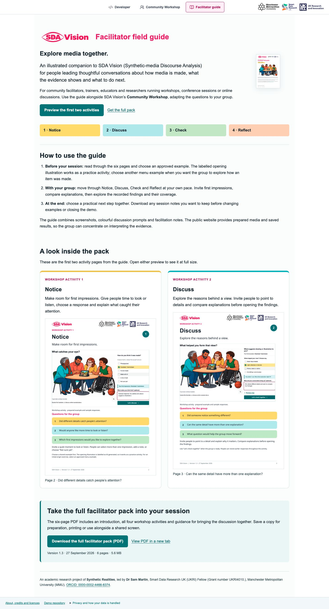
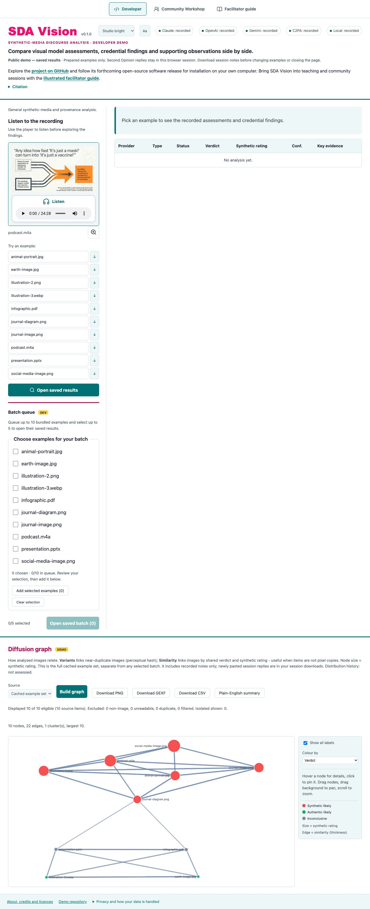

# Workshop, Developer and facilitator release-pack review

Display revision: `community-flow-2026-09-27.1` · 27 September 2026.

## Current experience

SDA stands for **Synthetic-media Discourse Analysis**. The full name appears at the website and pack introduction points.

Community Workshop, Developer and Facilitator guide share one centred navigation menu. The guide tab introduces its audience and use, previews Activities 1 and 2, and offers the six-page PDF. Switching tabs retains the selected workshop item and responses. The dedicated facilitator URL opens the same framework.

The Developer introduction uses a compact label, a stronger lead sentence and quieter supporting copy. Its public project link describes the forthcoming open-source software release; the project licence remains MIT. The full application source is private during preparation.

A magenta loading status accompanies media selection and batch preparation in both analysis views. A failed media fetch shows a retry message. Audio offers **Listen to the recording**, video offers **Watch the video**, and Developer's **View larger** opens an enlarged preview with a Close control and Escape-key dismissal. Playable media retains user-operated controls.

The batch checklist supports choosing several examples before adding them together. Up to ten examples can be queued, with up to five selected for one run. New additions are selected up to the available five-item limit. Already queued examples are marked; failed additions remain chosen for retry. Public batches open saved reports.

Podcast findings describe the recording's transcript. The prepared podcast's model scope is the first 12,000 characters of a 25,985-character transcript. AI-origin detection from the sound itself is outside this workflow. Media-specific scope, model counts and uncertainty accompany the findings.

Reflect offers Google Lens for plain image examples. Audio, video, PDF, presentation and transcript examples offer comparison with other evidence, relevant expertise and pausing before sharing.

In the saved workshop, **Let's check together** opens the selected findings. **What the checks suggest** brings every recorded provider together with expandable **Find out why** evidence. Podcast and video records include a Sound tab. The relationship graph is available in Check and Reflect; the full file and analysis record is in Developer. PDF and slide previews use 3200-pixel-wide presentation renders, within the original artwork's detail limits. [Workshop display verification](Community_Workshop_Review_2026-09-27.md).

## Screenshots and facilitator PDF

The current Community Workshop screenshot appears in both repository READMEs and the site's social-sharing image. The screenshots below document the integrated guide and Developer layout.

[Facilitator guide PDF, version 1.1](guides/SDA_Vision_Facilitator_Guide_v1.1.pdf) contains workshop screenshots and media-specific guidance. Its printed examples predate the compact inline-results display; the current [workshop instructions](Workshop_Activities_2026-09-25.md) describe the live flow. Version 1.0 remains an earlier approved edition. The editable PowerPoint remains for the researcher's conference and webinar use and is excluded from the release packs.

## Verification and scope

TypeScript, public/research builds, community presentation checks and workshop regression checks cover the updated UI. Browser checks cover loading success and failure, retry, opening a chosen saved batch, guide navigation, enlarged media, keyboard dismissal, centred navigation and phone-width layouts. The six PDF pages have been rendered and visually reviewed.

Saved reports, original media, provider prompts, scoring and consent requirements retain their prior implementation or bytes. No new provider inference is part of this revision. Original recorded-report downloads remain historical records; the workshop's current summaries use media-specific display wording.

The GitHub demo publishes the static website. The source repository remains private. The versioned Zenodo preparation folder contains the guide, previews, attribution, licence, metadata and checksums; deposit and DOI assignment remain pending. Physical-device playback, file-saving, projector and conference rehearsals remain researcher acceptance checks.
