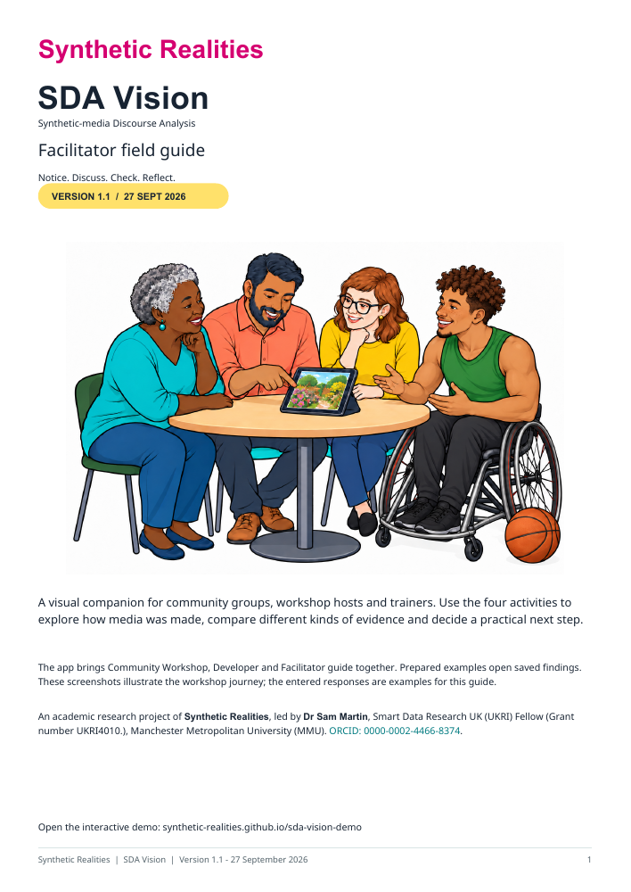
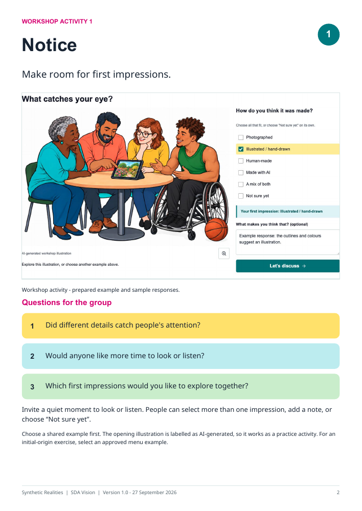
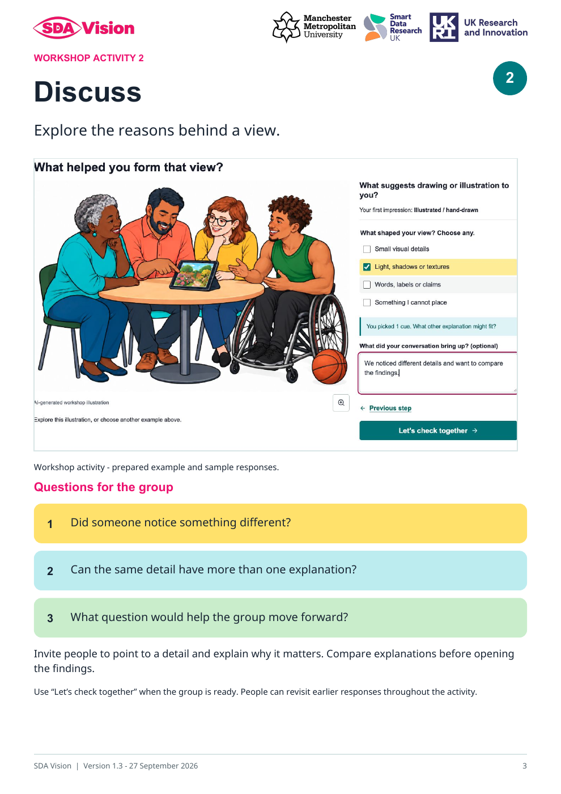

# Community Workshop and Facilitator guide

SDA stands for **Synthetic-media Discourse Analysis**.

An academic research project of **Synthetic Realities**, led by **Dr Sam Martin**, Smart Data Research UK (UKRI) Fellow (Grant number UKRI4010.), Manchester Metropolitan University (MMU). [ORCID: 0000-0002-4466-8374](https://orcid.org/0000-0002-4466-8374).

[Download the facilitator guide (PDF, version 1.1)](guides/SDA_Vision_Facilitator_Guide_v1.1.pdf). The guide brings together screenshots, questions for the group and practical facilitation guidance. Use it alongside the Community Workshop tab.

## Using the facilitator guide

For **community facilitators, trainers, educators and researchers** leading workshops, conference sessions or online discussions. The six-page guide combines screenshots, colourful group questions and practical notes for **Notice → Discuss → Check → Reflect**.

Before the session, read through the pack and choose an approved example. With the group, invite first impressions, compare explanations and then explore the recorded findings. Close by choosing practical next steps and downloading any session notes you want to keep. Adapt the pace and questions to the group.

[Open the guide introduction and previews](https://synthetic-realities.github.io/sda-vision-demo/facilitator.html).

| Workshop Activity 1 — Notice | Workshop Activity 2 — Discuss |
| --- | --- |
|  |  |

**Notice** makes room for looking, listening and first impressions. **Discuss** invites people to explain the details behind their view. The full pack also includes Check, Reflect and session guidance.

## Start here

The public demo opens in Community Workshop with an AI-generated workshop
illustration. The illustration supports **Notice → Discuss → Check → Reflect**.
From Discuss, **Let's check together** opens its saved Claude, OpenAI and Gemini
assessments. **Open recorded findings** is available when entering Check directly. The report's exact-file SHA-256 matches the displayed illustration.
The recorded filename is `illustration-1.png`; the opening image has its own
report and downloads and sits outside the ten-item example menu and set graph.

The **Start here** menu offers ten additional images, documents and podcast
examples. Each has saved findings. Selecting one starts a fresh set of workshop
responses. Community Workshop provides the four-step activity; Developer provides the research controls. The Facilitator guide tab supplies group prompts, activity previews and the PDF download while keeping the current workshop session available.

## Four activities

| Activity | What participants do | Findings and responses |
| --- | --- | --- |
| Notice | Choose one or more first impressions and optionally add a note. | Choices are labelled as personal impressions. “Not sure yet” is exclusive. |
| Discuss | Explore visual details, sound or wording; select relevant cues and add a discussion note. | In the saved-results demo, **Let's check together** opens the recorded findings and moves to Check. |
| Check | Open the recorded findings and compare their coverage and evidence. | A compact overview and model assessments support discussion. |
| Reflect | Compare first and later views, choose practical next actions and add a reflection. | End session downloads a summary; New session offers saving and reset controls. |

Each step can be revisited. Opening findings retains the responses already entered
for that item. The research app and live Conference profile use their separate
input and consent controls for new analysis of selected material.

## Findings and further detail

The workshop overview presents visual or transcript findings, relevant soundtrack
observations and the accompanying claim. Provider evidence includes model readings
and supporting file observations. Ratings are not calibrated probabilities.

**What the checks suggest** contains every recorded model and supporting check.
Each reading has a collapsed **Find out why** section with its key evidence,
including C2PA credential presence, integrity, signer trust and declarations.
Podcast and video results include a **Sound** tab; podcast model readings appear
under **Transcript**. Recorded absent, unavailable and failed states remain
visible. Developer holds the full file and analysis record.

**How the findings connect** is available in Check and Reflect. Notice and Discuss
focus on participants' observations and conversation. Saved findings retain
their analysis dates, models, sampling and uncertainty.

Google Lens and Second Opinion are available beside eligible recorded findings.
Visitors choose any material they attach in the external service. Sound-origin
detection remains outside this workflow; podcast model findings concern the
recorded transcript excerpt.

## Session notes and downloads

Workshop responses are held in the browser for the current item. They persist
across activities and presentation views and clear on changing item, resetting,
reloading or closing. The About/privacy information and reset dialog describe
storage and saving. Responses are separate from automated scores and provider
requests.

PDF, PPTX and CSV workshop summaries include responses when the inclusion option
is selected. Original recorded-report downloads preserve the saved analysis.
End session starts a download and leaves the current responses available. New
session offers a download and an explicit acknowledgement before clearing them.

## Testing on a phone or tablet

1. Enter an opening-image impression and note, then choose **Let's discuss**.
2. Select a discussion cue, add a note and choose **Let's check together**.
3. Confirm that findings open automatically. Expand **Find out why** beneath a model reading. If you enter Check directly, **Open recorded findings** remains available.
4. Choose **Reflect together** and enter a later view and reflection.
5. Open the Facilitator guide introduction, inspect the two activity previews and download the full PDF. Switch back to Community Workshop and check that responses remain. Select the podcast, check the loading status, and confirm that choosing a new item resets responses.
6. Expand **Find out why** for C2PA to inspect the recorded credential status. For the podcast, compare the Transcript and Sound tabs.
7. Save a workshop summary and open it in the device's intended application.

The public demo loads prepared files and saved results. The static website uses
no analysis backend or new provider calls. Live Conference rehearsal, native
file-saving and physical-device checks have their own acceptance records.

The findings overview and Evidence box each span the workshop page width. Key evidence opens beneath each reading. The footer groups credits, repository and privacy links. A magenta loading strip marks media preparation; PDF and slide previews use large renders of their first page or slide.

For image examples, Reflect’s **Find the original source** choice includes an **Open Google Lens** link, which opens a new tab. Use Google’s camera icon to select an image to share. Audio, video, document and transcript examples show the three other next steps: compare evidence, seek relevant expertise and pause before sharing.
