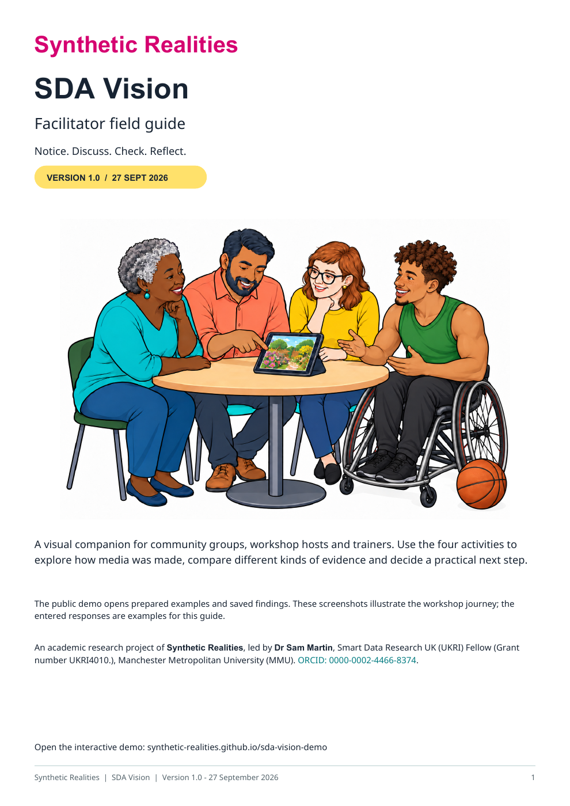

# Facilitator guide: Zenodo release pack

An academic research project of **Synthetic Realities**, led by **Dr Sam Martin**, Smart Data Research UK (UKRI) Fellow (Grant number UKRI4010.), Manchester Metropolitan University (MMU). [ORCID: 0000-0002-4466-8374](https://orcid.org/0000-0002-4466-8374).

[Download the illustrated facilitator guide (PDF, version 1.0)](guides/SDA_Vision_Facilitator_Guide_v1.0.pdf).

The six-page guide brings together Notice, Discuss, Check and Reflect screenshots, colourful group questions and practical facilitation guidance. The app provides Community Workshop and Developer views. Its **Facilitator guide** link opens an introduction, activity previews and the full-pack download.

The researcher approved version 1.0 and inclusion in the GitHub and Zenodo release packs on 27 September 2026. The guide is published through GitHub Pages. The Zenodo preparation bundle contains the exact PDF, this cover, attribution, MIT licence and file checksums. The guide's version is separate from the forthcoming software release.

## Who it is for and how to use it

For **community facilitators, trainers, educators and researchers** leading workshops, conference sessions or online discussions. The six-page guide combines screenshots, colourful group questions and practical notes for **Notice → Discuss → Check → Reflect**.

Before the session, read through the pack and choose an approved example. With the group, invite first impressions, compare explanations and then explore the recorded findings. Close by choosing practical next steps and downloading any session notes you want to keep. Adapt the pace and questions to the group.

[Explore the guide page](https://synthetic-realities.github.io/sda-vision-demo/facilitator.html).

| Workshop Activity 1 — Notice | Workshop Activity 2 — Discuss |
| --- | --- |
|  |  |

**Notice** makes room for looking, listening and first impressions. **Discuss** invites people to explain the details behind their view. The full pack also includes Check, Reflect and session guidance.

## Metadata for the guide

| Field | Value |
| --- | --- |
| Title | SDA Vision: Facilitator field guide |
| Version | 1.0 |
| Date | 2026-09-27 |
| Creator | Dr Sam Martin |
| Affiliation | Manchester Metropolitan University (MMU) |
| Role | Smart Data Research UK (UKRI) Fellow (Grant number UKRI4010.) |
| ORCID | https://orcid.org/0000-0002-4466-8374 |
| Funding | This work was supported by Smart Data Research UK, a UKRI investment; Grant number UKRI4010. |
| Licence | MIT; [project licence and attribution](../LICENSE) |
| Description | Illustrated facilitator guidance for the SDA Vision Community Workshop, with four activities, group questions and practical session guidance. The public demo uses prepared examples and saved assessments. |
| Related website | https://synthetic-realities.github.io/sda-vision-demo/ |
| DOI | Assigned by Zenodo at deposit; no guide DOI is recorded yet. |

The separately versioned software and existing podcast record retain their own metadata and identifiers. This package prepares the guide for deposit; it does not represent a completed Zenodo publication.
