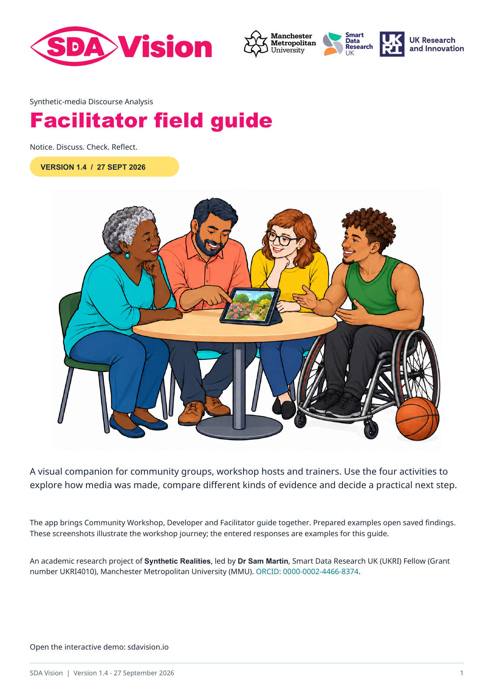
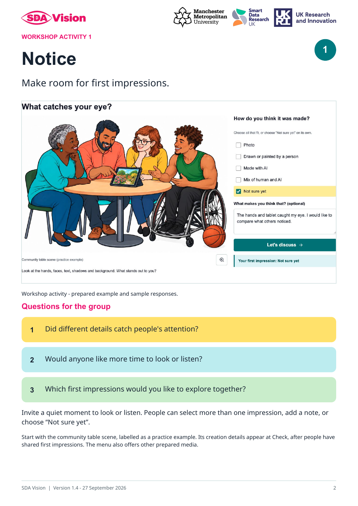
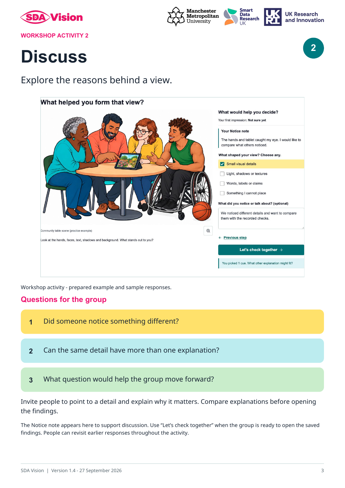

# Facilitator guide: Zenodo release pack

SDA stands for **Synthetic-media Discourse Analysis**.

An academic research project of **Synthetic Realities**, led by **Dr Sam Martin**, Smart Data Research UK (UKRI) Fellow (Grant number UKRI4010), Manchester Metropolitan University (MMU). [ORCID: 0000-0002-4466-8374](https://orcid.org/0000-0002-4466-8374).

[Download the illustrated facilitator guide (PDF, version 1.4)](../../docs/guides/SDA_Vision_Facilitator_Guide_v1.4.pdf).

The six-page guide brings together Notice, Discuss, Check and Reflect screenshots, colourful group questions and practical facilitation guidance. The app provides **Community Workshop**, **Developer** and **Facilitator guide** in one centred menu. The guide tab contains an introduction, activity previews and the full-pack download. Switching tabs retains the current workshop item and responses.

Version 1.0 was approved for the GitHub and Zenodo release packs on 27 September 2026. Version 1.4 carries the supplied SDA Vision branding, current workshop screenshots and media-specific guidance. The guide is published through GitHub Pages. The Zenodo preparation bundle contains the exact PDF, this cover, attribution, MIT licence and file checksums. The guide's version is separate from the forthcoming software release.

The live workshop opens findings from **Let's check together** and places expandable evidence beneath each reading. Its relationship graph appears in Check and Reflect, and detailed file records remain in Developer. The version 1.4 PDF illustrates the compact results layout with current workshop screenshots.

## Who it is for and how to use it

For **community facilitators, trainers, educators and researchers** leading workshops, conference sessions or online discussions. The six-page guide combines screenshots, colourful group questions and practical notes for **Notice → Discuss → Check → Reflect**.

Before the session, read through the pack and choose an example you have permission to share. With the group, invite first impressions, compare explanations and then explore the recorded findings. Close by choosing practical next steps and downloading any session notes you want to keep. Adapt the pace and questions to the group.

[Explore the guide page](https://sdavision.io/#facilitator).

| Notice | Discuss |
| --- | --- |
|  |  |

| Check | Reflect |
| --- | --- |
|  |  |

Start with the **Community table scene (practice example)**. Invite first impressions before opening its creation note at Check. Choose other media that you have permission to share. The guide explains all four activities, expandable model evidence and the separate scope of transcript and sound findings.

[Download the full facilitator pack (PDF, version 1.4)](../../docs/guides/SDA_Vision_Facilitator_Guide_v1.4.pdf).

## Metadata for the guide

| Field | Value |
| --- | --- |
| Title | SDA Vision: Facilitator field guide |
| Version | 1.4 |
| Date | 2026-09-27 |
| Creator | Dr Sam Martin |
| Affiliation | Manchester Metropolitan University (MMU) |
| Role | Smart Data Research UK (UKRI) Fellow (Grant number UKRI4010) |
| ORCID | https://orcid.org/0000-0002-4466-8374 |
| Funding | This work was supported by Smart Data Research UK, a UKRI investment; Grant number UKRI4010. |
| Licence | MIT; [project licence and attribution](../../LICENSE) |
| Description | Illustrated facilitator guidance for the SDA Vision Community Workshop, with four activities, group questions and practical session guidance. The public demo uses prepared examples and saved assessments. |
| Related website | https://sdavision.io/ |
| DOI | Assigned by Zenodo at deposit; no guide DOI is recorded yet. |

The separately versioned software and existing podcast record retain their own metadata and identifiers. This package prepares the guide for deposit; it does not represent a completed Zenodo publication.

## Affiliation and funding

 &nbsp;  &nbsp; 

Smart Data Research UK (UKRI) Fellowship, Grant number UKRI4010, hosted at Manchester Metropolitan University. Partner logos identify the affiliation and funding; their rights remain with their owners.

## PowerPoint preview setup

Uploaded slide previews use an optional local LibreOffice installation. The public demo includes prepared slides. See [installation and preview guidance](../../docs/PowerPoint_Preview_Setup.md).
